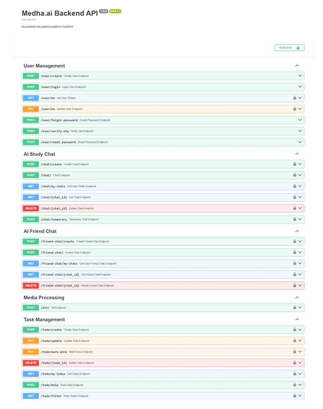
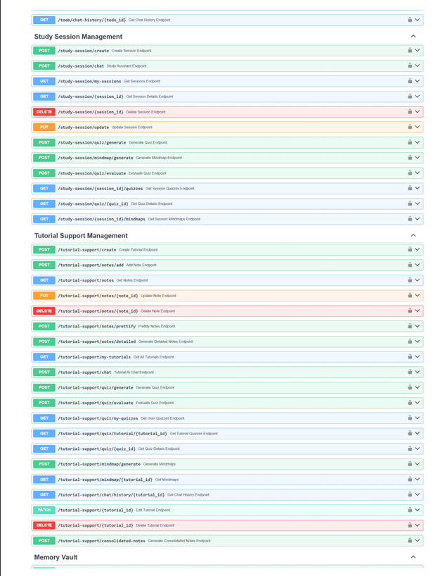
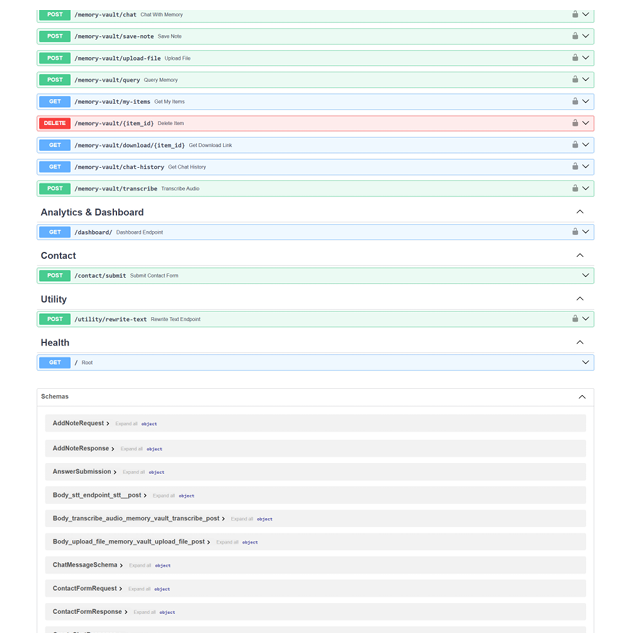

## Medha.ai Backend - Smart Learning Assistant

An AI-powered educational platform that helps students study smarter with personalized chat assistance, study session management with RAG, tutorial support, quizzes, mindmaps,memory vault and task management.

### Screenshots (Endpoints)
Screenshots used in this README live in `../images/`.

| User, Task & Chat Management | Tutorial Support & Study Session Management | Memory Vault & Analytics |
|---|---|---|
|  |  |  |


### Tech Stack
- Backend: FastAPI (Python 3.11), Pydantic v2, MongoDB (Atlas/local)
- LLMs: Groq API (gemma2-9b-it for all AI features),Gemini
- Speech: Groq Whisper (STT), Kokoro (TTS, WAV, 24kHz)
- RAG: FAISS + SentenceTransformers(all-MiniLM-L6-v2) + Reranking + COT
- Graphs: Graphviz (mindmap rendering)
- DevOps: Docker, CORS, .env configuration

### Core Features

**User Management**
- Create, login, update user profiles
- Password reset with email OTP verification

**AI Study Chat**
- Persistent chat sessions with context (last 40 messages)
- Chat history management (create, retrieve, delete)
- Auto-generated chat titles

**AI Friend Chat**
- Mental health companion with CBT/mindfulness approach
- Separate chat sessions with context
- Empathetic, Hinglish-friendly responses

**Study Session Management** (with RAG)
- Create study sessions with resources, syllabus, PYQ
- AI assistance using RAG (FAISS + embeddings stored in DB)
- Context-aware responses from uploaded materials
- Quiz and mindmap generation from session context
- Optimized RAG with pre-computed embeddings

**Tutorial Support Management**
- YouTube video tutorial tracking
- Time-stamped notes for videos
- AI-powered note prettification and detailed notes
- AI companion chat for tutorials
- Quiz generation from video transcripts (20 MCQs + 5 descriptive)
- Quiz evaluation with detailed reports
- Mindmap generation from tutorial notes

**Task Management**
- TODO CRUD operations (create, update, mark done, delete)
- Status filtering (pending, in_progress, done)
- AI assistant for task help with chat history
- Contextual guidance and step-by-step planning

**Memory Vault** (Personal Knowledge Base)
- Save **notes/snippets** (credentials, reminders, APIs, quick notes) with semantic indexing
- Upload **files** and make them searchable via embeddings + FAISS
- Supported uploads include:
  - Documents (PDF/TXT/MD/JSON/PY/JS/HTML/CSS)
  - Images (JPG/PNG/BMP/GIF/WEBP) with OCR text extraction
  - Audio (WAV/MP3/FLAC/M4A/WEBM/OGG) with speech-to-text; stored as a note
- **Unified Vault Chat** with RAG: ask questions, follow up with context, optionally request a secure download link
- **Download links** for stored files via Azure Blob **SAS URLs** (time-limited)
- Per-user **items list** and **chat history** for continuity
- Note: deleting an item removes metadata; Azure blobs are **not** automatically deleted

**Media Processing**
- Speech-to-Text: Groq Whisper
- Text-to-Speech: Kokoro (WAV, 24kHz)

**Analytics & Dashboard**
- Comprehensive user analytics in one endpoint
- Study chats, friend chats, study sessions, tutorials
- All quizzes and mindmaps with results
- TODO progress tracking
- Complete activity overview


### Project Structure
```
endpoints/      # FastAPI routers (user, chat, friend_chat, study_session, tutorial_support, todo, stt, tts, dashboard)
models/         # Pydantic models (user, chat, friend_chat, study_session, tutorial_support, todo)
schemas/        # Request/response schemas for all endpoints
services/       # Business logic (LLM calls, RAG, DB ops, email)
prompts/        # Centralized AI system prompts and templates
utils/          # Database connection, email utilities
```

### Run Locally

Prerequisites
- Python 3.11
- Node.js 18+
- MongoDB (local or Atlas connection string)
- Graphviz system binary (`dot`) installed and on PATH
- Windows users for TTS: ensure `espeak-ng` and `libsndfile` equivalents or use Docker

1) Backend setup
```
cp .env.example .env   # if you have an example, else create a new .env
# .env keys (required)
GROQ_API_KEY=your_groq_key
MONGO_URI=mongodb://localhost:27017/exam_revision_assistant
GROQ_GEMMA_MODEL=gemma2-9b-it

pip install -r requirements.txt
uvicorn main:app --reload --port 8000
```

2) Frontend setup
```
cd frontend
npm install
echo VITE_API_BASE_URL=http://localhost:8000 > .env.local
npm run dev
```

3) Optional: Docker
```
docker build -t exam-assistant .
docker run -p 8000:8000 --env-file .env exam-assistant
```

### Key Environment Variables
- `GROQ_API_KEY` (required) - For all AI features
- `MONGO_URI` (required) - MongoDB connection string (must include database name)
- `GROQ_MODEL` (optional) - Default: gemma2-9b-it
- `JWT_SECRET_KEY` (required) - Secret key for JWT token generation (change in production!)
- `EMAIL_USER` (required for password reset) - Gmail address for sending OTPs
- `EMAIL_PASSWORD` (required for password reset) - Gmail app password

### JWT Authentication 🔐

**All API endpoints require JWT authentication** except user registration and login.

1. **Register or Login** to get your JWT token:
```bash
curl -X 'POST' 'http://localhost:8000/user/login' \
  -H 'Content-Type: application/json' \
  -d '{"email": "user@example.com", "password": "yourpassword"}'
```

2. **Use the token** in all subsequent requests:
```bash
curl -X 'GET' 'http://localhost:8000/dashboard/' \
  -H 'Authorization: Bearer YOUR_JWT_TOKEN_HERE'
```

3. **Token expires after 7 days** - login again to get a new token.

### API Documentation
Once the server is running, visit:
- Swagger UI: `http://localhost:8000/docs`
- ReDoc: `http://localhost:8000/redoc`

### API Quickstart (sample endpoints)

**Note:** All endpoints below (except create/login) require `Authorization: Bearer <token>` header

**User Management**
```bash
POST /user/create      # Create new user (returns JWT token)
POST /user/login       # Login user (returns JWT token)
PUT  /user/me          # Update authenticated user's details
GET  /user/me          # Get authenticated user's details
POST /user/forgot-password  # Initiate password reset
POST /user/verify-otp      # Verify OTP
POST /user/reset-password  # Reset password
```

**AI Study Chat**
```bash
POST /chat/create         # Create new chat session
POST /chat/               # Send message (with chat_id)
GET  /chat/{chat_id}      # Get chat history
GET  /chat/my-chats       # Get all chats for authenticated user
DELETE /chat/{chat_id}    # Delete chat
```

**AI Friend Chat** (same structure as Study Chat)
```bash
POST /friend-chat/create
POST /friend-chat/
GET  /friend-chat/{chat_id}
GET  /friend-chat/my-chats    # Get all chats for authenticated user
DELETE /friend-chat/{chat_id}
```

**Study Session Management**
```bash
POST /study-session/create        # Create session with resources
POST /study-session/chat          # AI assistance with RAG
GET  /study-session/my-sessions   # Get all sessions for authenticated user
GET  /study-session/{session_id}  # Get session details
PUT  /study-session/update        # Update session materials
DELETE /study-session/{session_id}  # Delete session
POST /study-session/quiz/generate   # Generate quiz
POST /study-session/mindmap/generate  # Generate mindmaps
```

**Tutorial Support**
```bash
POST /tutorial-support/create              # Create tutorial session
POST /tutorial-support/notes/add           # Add timestamped note
GET  /tutorial-support/notes               # Get all notes
PUT  /tutorial-support/notes/{note_id}     # Update note
DELETE /tutorial-support/notes/{note_id}   # Delete note
POST /tutorial-support/notes/prettify      # Prettify notes
POST /tutorial-support/notes/detailed      # Generate detailed notes
POST /tutorial-support/chat                # AI companion chat
POST /tutorial-support/quiz/generate       # Generate quiz from transcript
POST /tutorial-support/quiz/evaluate       # Evaluate quiz answers
GET  /tutorial-support/quiz/{quiz_id}      # Get quiz details
GET  /tutorial-support/quiz/my-quizzes     # Get all quizzes for authenticated user
POST /tutorial-support/mindmap/generate    # Generate mindmaps
GET  /tutorial-support/mindmap/{tutorial_id}  # Get mindmaps
GET  /tutorial-support/my-tutorials        # Get all tutorials for authenticated user
```

**Task Management**
```bash
POST /todo/create          # Create new todo
PUT  /todo/update          # Update todo
PUT  /todo/mark-done       # Mark todo as done
DELETE /todo/{todo_id}     # Delete todo
GET  /todo/my-todos        # Get all todos for authenticated user
GET  /todo/filter?status=pending  # Filter by status (pending/in_progress/done)
POST /todo/help            # AI assistance for todo
GET  /todo/chat-history/{todo_id}  # Get todo chat history
```

**Media Processing**
```bash
POST /stt  # Speech to text (UploadFile)
POST /tts  # Text to speech { text } -> { audio_url: base64 }
```

**Analytics & Dashboard**
```bash
GET /dashboard/  # Get comprehensive user analytics for authenticated user
                 # Returns: all chats, sessions, tutorials, 
                 # quizzes, mindmaps, and todos with counts
```

### Performance Optimizations
- **RAG with Pre-computed Embeddings**: Study session RAG creates embeddings once during session creation and stores them in MongoDB, reducing query latency from 2-5s to 0.1-0.3s (10-50x faster)
- **Efficient Chat Context**: Only last 40 messages (20 exchanges) are loaded for context
- **YouTube Transcript Caching**: Transcripts are fetched once per quiz generation

### Notes & Tips
- All images/audio returned as base64 data URLs (no static hosting needed)
- Robust JSON parsing with retry logic for LLM outputs
- Graphviz must be installed on the system for mindmap rendering
- Email OTP requires Gmail account with app password configured
- MongoDB collections are auto-created on first use


