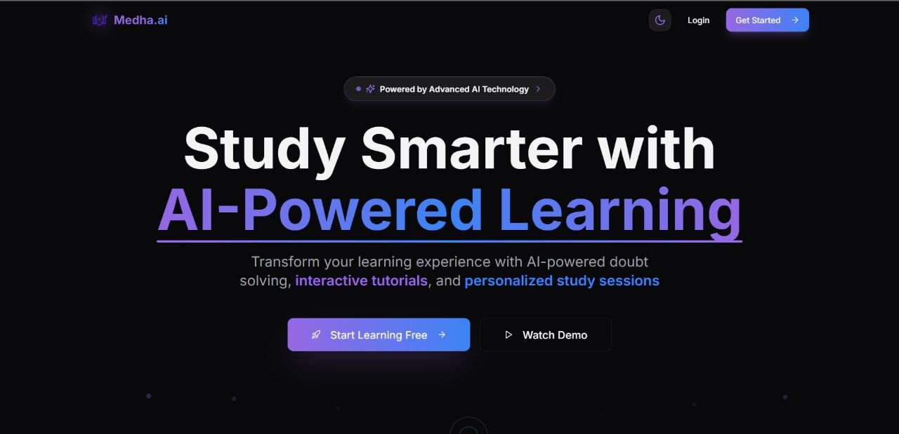
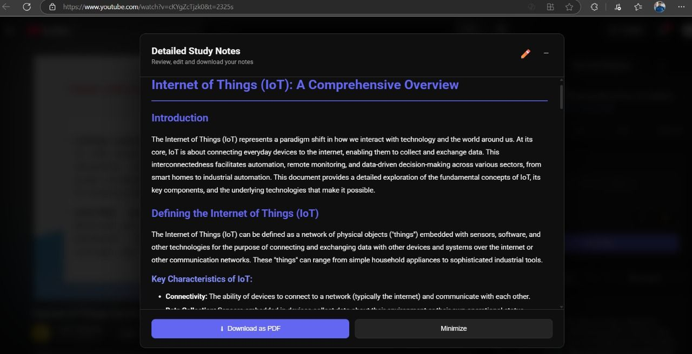
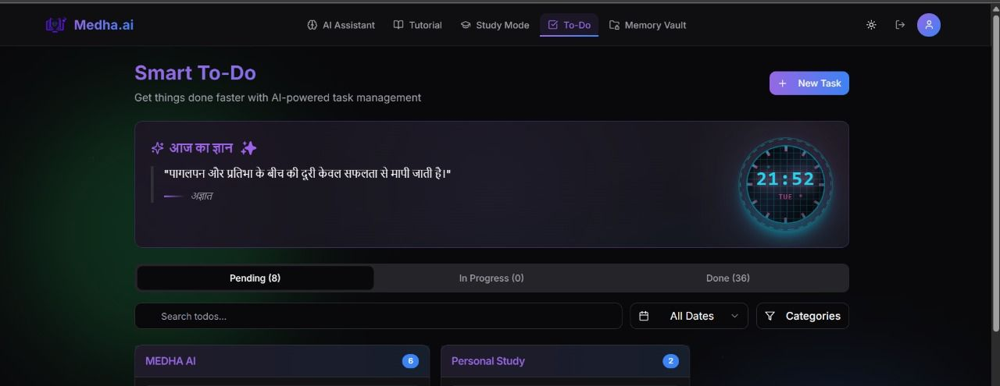
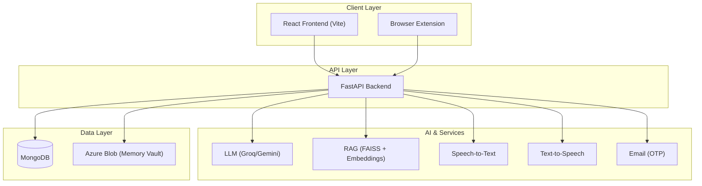
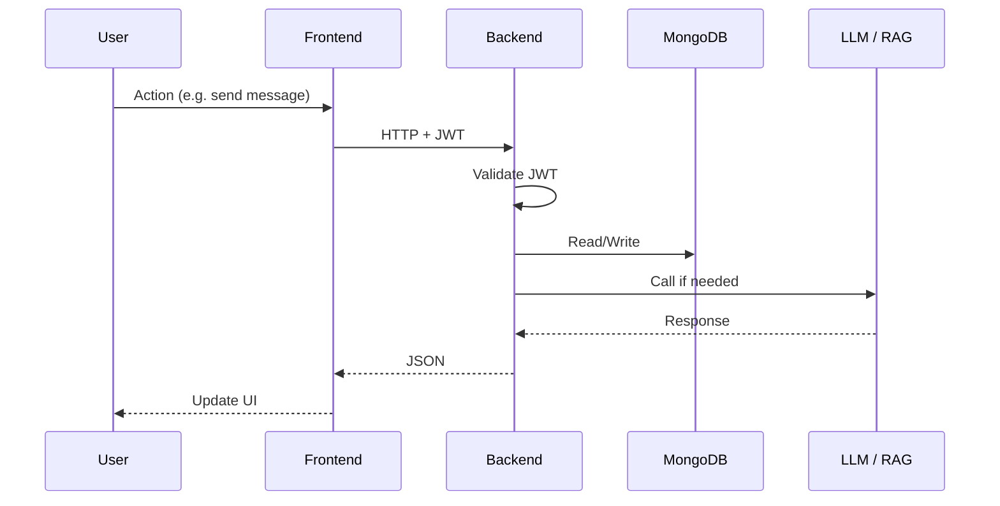
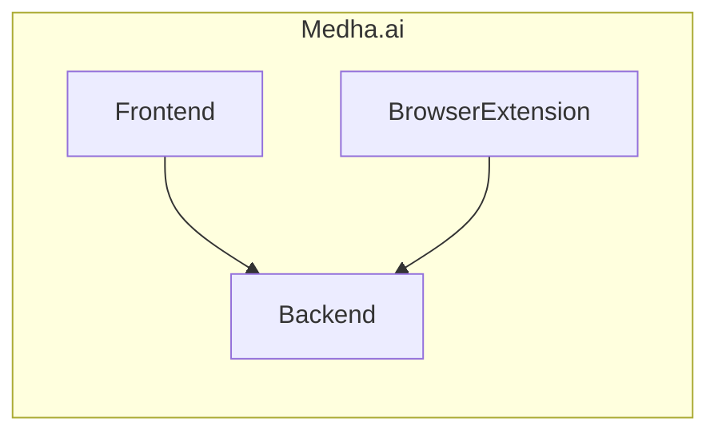

# Medha.ai — AI-Powered Learning Platform

An intelligent learning companion that transforms education through **AI-powered doubt solving**, **RAG-based study sessions**, **interactive tutorial support**, **voice I/O**, and **personalized analytics**. Built as a full-stack application with a modern React frontend, FastAPI backend, and optional browser extension for learning on YouTube.

---

## What It Is

**Medha.ai** is a full-stack, AI-first educational platform that acts as a 24/7 study companion. It combines **LLMs** (Groq/Gemini), **RAG** (FAISS + embeddings + Reranking + COT), **speech** (STT/TTS), and **structured learning tools** (quizzes, mindmaps, todos) into one cohesive experience—from chatting with AI about your syllabus to watching YouTube tutorials with auto-generated notes and quizzes.

---

## What It Does

| Area | Capability |
|------|------------|
| **Study** | AI chat with subject context, persistent sessions, voice input/output |
| **Friend** | Mental wellness companion with CBT/mindfulness-style, Hinglish-friendly chat |
| **Sessions** | Upload PDFs (syllabus, PYQs, resources), RAG-based Q&A, quiz & mindmap generation |
| **Tutorials** | YouTube videos with timestamped notes, AI note prettification, quiz from transcript, mindmaps |
| **Memory Vault** | Personal knowledge base: save notes, upload files, semantic search + RAG chat, secure download links |
| **Tasks** | Smart to-do with AI suggestions, status tracking, contextual help |
| **Analytics** | Single dashboard with chats, sessions, tutorials, quizzes, mindmaps, and TODO progress |
| **Extension** | Use Medha.ai on YouTube: notes, AI chat, quizzes, mindmaps without leaving the video |

---

## Features

### AI & Learning

- **AI Doubt Assistant** — ChatGPT-like study chat with text and voice; subject-specific context
- **AI Friend Chat** — Empathetic mental-health companion with separate sessions
- **RAG-Powered Study Sessions** — Upload materials; get answers grounded in your PDFs (FAISS + embeddings)
- **Interactive Tutorial Watch** — YouTube + AI notes, auto-pause on questions, quiz generation, mind maps
- **Memory Vault** — Save notes/snippets and upload files; ask questions with RAG, get time-limited download links when needed
- **Smart To-Do** — Tasks with AI suggestions and step-by-step guidance
- **Voice I/O** — Speech-to-text (Groq Whisper) and text-to-speech (Kokoro) for hands-free learning
- **Learning Analytics** — Progress, quiz performance, and study patterns in one dashboard

### Platform

- **JWT Auth** — Register, login, password reset with email OTP
- **Multi-Mode Chat** — Study mode and Friend mode with history and titles
- **Quiz System** — MCQs and descriptive questions with AI evaluation and feedback
- **Mindmaps** — Auto-generated from study sessions and tutorial notes (Graphviz)
- **Browser Extension** — Notes, AI chat, quizzes, and mindmaps on any YouTube video

---

## Benefits

- **One place** for doubts, tutorials, study materials, tasks, and wellness chat  
- **Faster revision** with RAG (pre-computed embeddings for low-latency answers)  
- **Better retention** via quizzes and mindmaps generated from your content  
- **Accessible** with voice input and TTS for different learning preferences  
- **Portable** with the browser extension for learning while watching videos  
- **Transparent progress** through a single analytics dashboard  

---

## Screenshots

Screenshots used in this README live in `images/`.

| Landing Page | Study Companion | Tutorial Companion |
|---|---|---|
|  |  |  |

| Organized Study & Notes | Notes | Smart To-Dos |
|---|---|---|
|  |  |  |

| Smart Quizzes | Personalized Quizzes | Browser Extension |
|---|---|---|
|  |  |  |

---

## Architecture & Flow

### High-Level System Architecture



### Request Flow (Authenticated)



### Project Structure



## Tech Stack

| Layer | Technologies |
|-------|---------------|
| **Frontend** | React 18, TypeScript, Vite, shadcn/ui, Radix UI, Tailwind CSS, Framer Motion, React Router v6, Axios, PDF.js, React Markdown |
| **Backend** | FastAPI, Python 3.11, Pydantic v2, MongoDB, JWT auth |
| **AI/ML** | Groq API (e.g. Gemma), Gemini, FAISS, SentenceTransformers (all-MiniLM-L6-v2),Langchain, Groq Whisper (STT), Kokoro (TTS) |
| **RAG** | FAISS + pre-computed embeddings+Reranking stored in MongoDB |
| **DevOps** | Docker, GitHub Actions (e.g. Azure Container Apps), .env configuration |

---

## How to Run

### Prerequisites

- **Python 3.11** (backend)
- **Node.js 18+** (frontend)
- **MongoDB** (local or Atlas)
- **Graphviz** (`dot` on PATH) for mindmaps
- **Optional:** Gmail app password for password-reset OTP

### 1. Backend

```bash
cd Backend
cp env.example .env
# Edit .env: GROQ_API_KEY, MONGO_URI, JWT_SECRET_KEY, GMAIL_APP_PASSWORD, etc.

# With uv
uv venv
.venv\Scripts\activate   # Windows
# source .venv/bin/activate  # Linux/macOS
uv pip install -r requirements.txt
uvicorn main:app --host 0.0.0.0 --port 8000
```

- API docs: [http://localhost:8000/docs](http://localhost:8000/docs)  
- ReDoc: [http://localhost:8000/redoc](http://localhost:8000/redoc)

### 2. Frontend

```bash
cd Frontend
npm install
echo VITE_API_BASE_URL=http://localhost:8000 > .env
# or create .env with: VITE_API_BASE_URL=http://localhost:8000
npm run dev
```

- App: **http://localhost:8080** (or the port Vite prints)

### 3. Browser Extension (Optional)

```bash
cd BrowserExtension
# Update backend/frontend URLs in lib/api.js and popup/popup.js if needed
# Chrome: chrome://extensions → Developer mode → Load unpacked → select BrowserExtension/
# Firefox: about:debugging → Load Temporary Add-on → select manifest.json
```

- **Backend must be running** before using the frontend or extension.

---

## Environment Variables

### Backend (see `Backend/env.example`)

| Variable | Purpose |
|----------|---------|
| `GROQ_API_KEY` | Required for AI (chat, RAG, friend, todo, etc.) |
| `MONGO_URI` | MongoDB connection string (include DB name) |
| `JWT_SECRET_KEY` | JWT signing (change in production) |
| `GMAIL_APP_PASSWORD` | Password reset OTP emails |
| `EMAIL_USER` / `SMTP_*` | Email sender config |
| `AZURE_STORAGE_CONNECTION_STRING` | Optional; for Memory Vault |

### Frontend

| Variable | Purpose |
|----------|---------|
| `VITE_API_BASE_URL` | Backend base URL (e.g. `http://localhost:8000`) |

---

## Quick Reference

| I want to… | Where to look |
|------------|----------------|
| Run backend | [How to Run → Backend](#1-backend) |
| Run frontend | [How to Run → Frontend](#2-frontend) |
| Run extension | [How to Run → Browser Extension](#3-browser-extension-optional) |
| See API endpoints | [Backend/README.md](Backend/README.md) + `/docs` |
| See frontend structure | [Frontend/README.md](Frontend/README.md) |
| Configure env | [Environment Variables](#environment-variables) |

---

## Project Owner

- **Name**: Shubham Kumar Gupta
- **Role**: AI/ML Engineer & Full-Stack Developer
- **Email**: [shubham07kumargupta@gmail.com](mailto:shubham07kumargupta@gmail.com)
- **Mobile**: `+91 8002007238`
- **LinkedIn**: [linkedin.com/in/shubhamiitpatna](https://linkedin.com/in/shubhamiitpatna)
- **GitHub**: [github.com/SHubhamanjk](https://github.com/SHubhamanjk)
---

*Medha.ai — full-stack AI for learning: React + FastAPI + LLMs + RAG + voice + analytics.*
